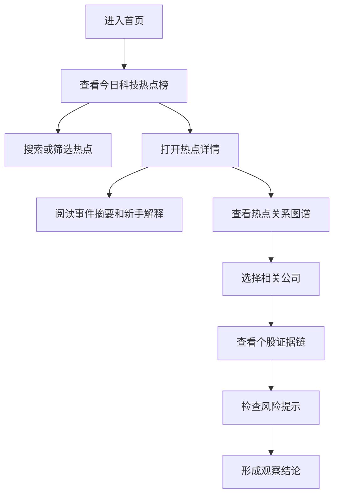

# 科技热点投资情报助手 PRD

## 1. 产品概述
科技热点投资情报助手面向关注科技行业的新手投资者，把分散的新闻、公告、产业链信息和社区情绪整理成可验证的投资情报链路。
- 主要解决新人“信息过载、热点误判、概念股混淆、缺少风险意识”的问题。
- 产品价值是帮助用户从“看到热点”升级为“理解事件、验证关联、识别风险、形成观察清单”。

## 2. 核心功能

### 2.1 用户角色
| 角色 | 注册方式 | 核心权限 |
|------|----------|----------|
| 访客用户 | 无需登录 | 浏览热点榜、热点详情、个股证据链、学习卡片 |
| 登录用户 | 邮箱或第三方登录，首版可预留 | 保存关注、提醒和个人复盘，首版暂不实现 |

### 2.2 功能模块
1. **科技热点榜**：展示今日科技热点、热度评分、热度变化、可信度、相关公司数量和风险等级。
2. **热点详情页**：解释热点事件、时间线、信息来源、产业链影响、相关公司和风险提示。
3. **热点关系图谱**：用中心图谱呈现“事件 - 产业链环节 - 上市公司 - 证据来源”的关系。
4. **个股证据链**：展示某家公司为什么与热点相关，包括主营匹配、公告证据、业务占比、市场热度和风险。
5. **基础搜索**：按热点、公司、股票代码、产业链关键词搜索。
6. **新手解释模式**：把科技概念和金融术语翻译成白话，提供“这是什么、为什么重要、怎么验证、常见误区”。
7. **风险扫描**：提示纯概念炒作、无收入支撑、高位拥挤、负面公告、解禁减持、消息源可信度不足等风险。

### 2.3 页面详情
| 页面名称 | 模块名称 | 功能描述 |
|----------|----------|----------|
| 首页 | 热点雷达总览 | 顶部展示产品定位、市场状态摘要、今日科技热点数量、平均可信度、风险分布 |
| 首页 | 今日热点榜 | 支持按热度、增速、可信度、风险等级排序；每张卡片包含一句话解释、相关公司、证据数量 |
| 首页 | 快速搜索 | 输入关键词后筛选热点和个股，提供推荐关键词 |
| 首页 | 新手学习卡 | 展示科技主题解释，例如 AI 算力、HBM、先进封装、人形机器人 |
| 热点详情 | 事件摘要 | 用白话解释热点来源、核心变量、影响路径和观察重点 |
| 热点详情 | 关系图谱 | 图形化展示事件、产业链环节、相关公司、证据来源的连接 |
| 热点详情 | 相关公司表 | 按相关性、证据强度、热度和风险排序 |
| 热点详情 | 时间线 | 展示热点从首发、扩散、行情反馈到风险暴露的过程 |
| 个股详情 | 证据链 | 展示该公司与热点相关的证据、证据来源和可信度 |
| 个股详情 | 风险面板 | 展示业务占比不足、估值拥挤、公告不确定、市场情绪过热等风险 |
| 个股详情 | 新手解释 | 用白话总结“它为什么被市场关注”和“还需要验证什么” |

## 3. 核心流程
用户进入首页后先查看科技热点榜，选择一个热点进入详情，阅读白话摘要和风险提示，再通过关系图谱查看相关产业链和公司。用户点击公司后进入个股证据链，判断关联是否真实，并回到热点列表继续对比。

## 4. 用户界面设计

### 4.1 设计风格
- 主色：深海蓝 `#071926`，用于营造专业金融信息工作台氛围。
- 强调色：日光黄 `#FFD166`、珊瑚红 `#FF5A5F`、电光青 `#00D1FF`，对应机会、风险、实时信息。
- 按钮风格：高对比分段按钮、轻 3D 投影、清晰悬停态。
- 字体风格：标题使用更有科技感和金融终端感的紧凑字体，正文使用高可读中文字体栈。
- 布局风格：桌面优先，中心是“热点图谱/雷达工作台”，两侧是榜单、证据和风险面板。
- 图标风格：不用 emoji 堆砌，使用线性图标、状态圆点、热度条、标签和评分环。

### 4.2 页面设计概览
| 页面名称 | 模块名称 | UI 元素 |
|----------|----------|---------|
| 首页 | 顶部总览 | 深色渐变背景、实时扫描光带、统计卡片、醒目 CTA |
| 首页 | 热点榜 | 紧凑卡片、热度条、可信度徽章、风险色条、排序控件 |
| 首页 | 学习卡 | 横向知识卡片、术语解释、验证清单 |
| 热点详情 | 图谱画布 | 中心节点、环形产业链节点、证据连接线、焦点高亮 |
| 热点详情 | 公司列表 | 表格 + 卡片混合布局，强调相关性理由和证据数量 |
| 个股详情 | 证据链 | 时间轴、来源标签、可信度评分、业务匹配说明 |
| 个股详情 | 风险面板 | 红/黄/蓝风险分级、风险原因、验证建议 |

### 4.3 响应式
桌面优先设计，适配 1440px 和 1280px 宽屏。移动端保留主要浏览流程：热点榜、热点详情、个股证据链纵向堆叠，关系图谱降级为可横向滚动的节点列表。

### 4.4 首版不做
- 不做真实交易和荐股。
- 不做个性化持仓提醒。
- 不做实时推送、短信和微信提醒。
- 不做复杂登录系统，最多预留 Supabase Auth 接口。
- 不做自动下单、收益预测和确定性买卖建议。
