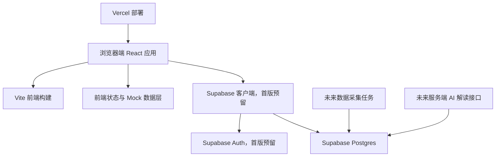
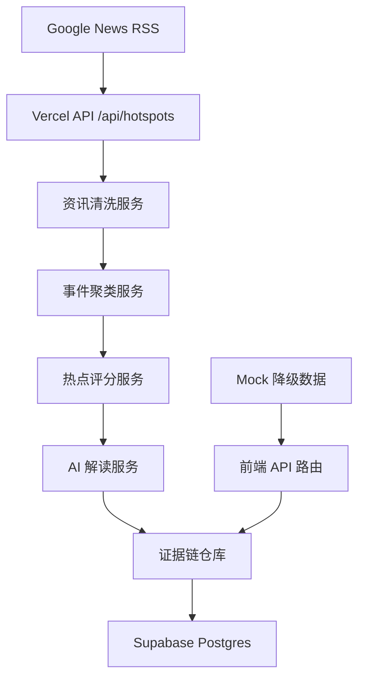
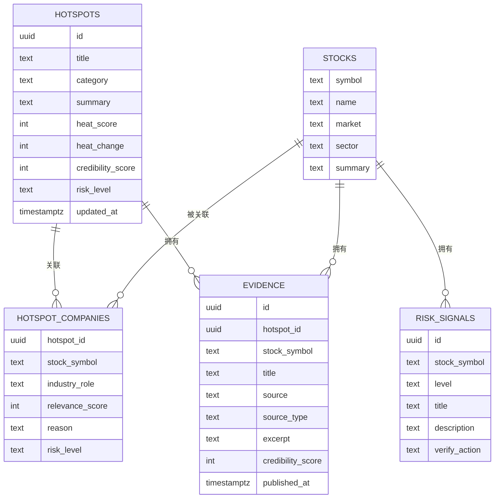

# 科技热点投资情报助手技术架构

## 1. 架构设计



首版以高完成度前端 MVP 为目标，使用本地 Mock 数据跑通完整产品体验，同时通过 Vercel Serverless Function 接入首批真实资讯数据源，并在代码结构和数据模型上预留 Supabase、AI 摘要和数据采集能力。

## 2. 技术描述
- 前端：React 18 + TypeScript + Vite。
- 样式：Tailwind CSS 3，使用设计 token 管理色彩、阴影、圆角和动效。
- 图谱：首版使用自定义 SVG/HTML 节点实现轻量关系图，避免过早引入复杂图谱依赖。
- 路由：React Router，支持首页、热点详情页、个股详情页。
- 状态：React hooks + 本地数据模块，首版不引入全局状态库。
- 数据库：Supabase Postgres，首版提供 schema 和类型定义，前端默认使用 Mock 数据并可合并实时资讯。
- 部署：GitHub 托管代码，Vercel 自动部署前端和 `/api/*` Serverless Function。
- 真实数据源：首批接入 Google News RSS，按科技主题关键词拉取实时资讯；源不可用时自动降级到 Mock 数据。
- AI 能力：首版只实现 AI 解读样式和数据结构，未来通过服务端接口生成，避免前端暴露 API Key。

## 3. 路由定义
| 路由 | 用途 |
|------|------|
| `/` | 首页，展示科技热点榜、搜索、雷达总览、新手学习卡 |
| `/hotspots/:id` | 热点详情页，展示事件摘要、关系图谱、相关公司、时间线、风险提示 |
| `/stocks/:symbol` | 个股详情页，展示个股证据链、热点关联、风险扫描、新手解释 |

## 4. API 定义
首版启用轻量 Serverless API 聚合真实资讯，并保留前端 Mock 数据作为降级源。为了后续接入 Supabase、行情源和服务端 AI，先定义核心类型。

### 4.1 真实资讯接口
`GET /api/hotspots`

```typescript
interface LiveHotspotsResponse {
  generatedAt: string;
  source: {
    name: string;
    status: 'ok' | 'empty' | 'error';
  };
  hotspots: Array<{
    id: string;
    category: string;
    liveSourceCount: number;
    updatedAt: string;
    evidence: Evidence[];
  }>;
  errors?: string[];
}
```

### 4.2 核心类型

```typescript
export type RiskLevel = 'low' | 'medium' | 'high';

export interface Hotspot {
  id: string;
  title: string;
  category: string;
  summary: string;
  heatScore: number;
  heatChange: number;
  credibilityScore: number;
  riskLevel: RiskLevel;
  sourceCount: number;
  companyCount: number;
  tags: string[];
  updatedAt: string;
}

export interface Evidence {
  id: string;
  title: string;
  source: string;
  sourceType: 'announcement' | 'news' | 'policy' | 'research' | 'community';
  url?: string;
  publishedAt: string;
  credibilityScore: number;
  excerpt: string;
}

export interface RelatedCompany {
  symbol: string;
  name: string;
  market: string;
  industryRole: string;
  relevanceScore: number;
  evidenceCount: number;
  riskLevel: RiskLevel;
  reason: string;
}

export interface StockProfile {
  symbol: string;
  name: string;
  market: string;
  sector: string;
  summary: string;
  relatedHotspots: string[];
  evidence: Evidence[];
  risks: RiskSignal[];
}

export interface RiskSignal {
  id: string;
  level: RiskLevel;
  title: string;
  description: string;
  verifyAction: string;
}
```

## 5. 服务端架构图
真实数据和 AI 生成能力放在服务端，首版只预留，不在浏览器端直接调用大模型。



## 6. 数据模型

### 6.1 数据模型定义


### 6.2 数据定义语言
```sql
create table if not exists hotspots (
  id uuid primary key default gen_random_uuid(),
  title text not null,
  category text not null,
  summary text not null,
  heat_score int not null check (heat_score between 0 and 100),
  heat_change int not null default 0,
  credibility_score int not null check (credibility_score between 0 and 100),
  risk_level text not null check (risk_level in ('low', 'medium', 'high')),
  tags text[] not null default '{}',
  updated_at timestamptz not null default now()
);

create table if not exists stocks (
  symbol text primary key,
  name text not null,
  market text not null,
  sector text not null,
  summary text not null
);

create table if not exists hotspot_companies (
  hotspot_id uuid references hotspots(id) on delete cascade,
  stock_symbol text references stocks(symbol) on delete cascade,
  industry_role text not null,
  relevance_score int not null check (relevance_score between 0 and 100),
  reason text not null,
  risk_level text not null check (risk_level in ('low', 'medium', 'high')),
  primary key (hotspot_id, stock_symbol)
);

create table if not exists evidence (
  id uuid primary key default gen_random_uuid(),
  hotspot_id uuid references hotspots(id) on delete cascade,
  stock_symbol text references stocks(symbol) on delete cascade,
  title text not null,
  source text not null,
  source_type text not null check (source_type in ('announcement', 'news', 'policy', 'research', 'community')),
  excerpt text not null,
  credibility_score int not null check (credibility_score between 0 and 100),
  published_at timestamptz not null
);

create table if not exists risk_signals (
  id uuid primary key default gen_random_uuid(),
  stock_symbol text references stocks(symbol) on delete cascade,
  level text not null check (level in ('low', 'medium', 'high')),
  title text not null,
  description text not null,
  verify_action text not null
);

create index if not exists idx_hotspots_updated_at on hotspots(updated_at desc);
create index if not exists idx_hotspots_heat_score on hotspots(heat_score desc);
create index if not exists idx_evidence_hotspot_id on evidence(hotspot_id);
create index if not exists idx_evidence_stock_symbol on evidence(stock_symbol);
```
